<!-- Generated by `qits database diagram` (jpa). Do not edit: the entity-diagram automation rewrites this file on every release request fold. -->
# Persistence unit `ci`

Datasource `ci` · package `eu.wohlben.qits.ci.entity` · 7 entities

```mermaid
erDiagram
  %% ci_owed_event: eu.wohlben.qits.ci.entity.CiOwedEvent (ci)
  ci_owed_event {
    string event_id PK "not null"
    instant accepted_at "not null"
    string event_name "not null"
    instant occurred_at "not null"
    text payload
  }
  %% ci_release_announcement: eu.wohlben.qits.ci.entity.CiReleaseAnnouncement (ci)
  ci_release_announcement {
    string id PK "not null"
    string announce "length 16"
    instant announced_at
    int artifact_index "not null"
    instant created_at "not null"
    string decision "length 16"
    instant finished_at "not null"
    string package_name "not null, length 512"
    string package_type "not null, length 32"
    string project_id
    string publish "length 16"
    string repo_id "not null"
    string repo_name
    string run_id "not null"
    string section "length 16"
    string skip_reason "length 16"
    string trigger_event_id
    string unchanged_since "length 128"
    string version "not null"
  }
  %% ci_report: eu.wohlben.qits.ci.entity.CiReport (ci)
  ci_report {
    uuid id PK "not null"
    string baseline_run_id
    string baseline_version
    text highlights "not null"
    string kind "not null, length 64"
    int kind_version "not null"
    text payload "not null"
    int payload_bytes "not null"
    string run_id "not null"
    int step_index "not null"
    instant submitted_at "not null"
  }
  %% ci_run: eu.wohlben.qits.ci.entity.CiRun (ci)
  ci_run {
    string id PK "not null"
    string archetype_config_path "length 512"
    string archetype_name "length 64"
    string archetype_rev "length 64"
    string archetype_version "length 64"
    string branch "not null"
    string cancellation_reason "length 255"
    uuid causation_id
    string commit_sha "not null, length 64"
    string config_path "not null, length 512"
    instant created_at "not null"
    string daemon_version "length 64"
    text downstream_repos
    text expected_step_durations
    instant finished_at
    enum phase
    string priority "length 32"
    string project_id "length 255"
    enum purpose "not null"
    string release_request_id "length 255"
    string repo_id "not null"
    string repo_name "length 255"
    string retry_of_run_id "length 255"
    string retry_reason "length 255"
    uuid runner_id
    instant started_at
    enum status "not null"
    text step_images
    string superseded_by_run_id "length 255"
    uuid target_runner_id
    text trigger_config
    string trigger_event_id "length 255"
    string trigger_event_name "length 255"
    instant trigger_event_occurred_at
    text trigger_event_payload
    enum trigger_type "not null"
  }
  %% ci_runner: eu.wohlben.qits.ci.entity.CiRunner (ci)
  ci_runner {
    uuid id PK "not null"
    jsonb capabilities
    uuid causation_id
    string client_id "length 255"
    instant connection_loss_window_start
    instant created_at "not null"
    string description "length 1024"
    text infra_failure_runs
    int infra_failures "not null"
    instant last_healthcheck_at
    text last_healthcheck_detail
    string last_healthcheck_result "length 16"
    string last_healthcheck_run_id "length 255"
    instant last_seen_at
    string name "not null, length 64"
    jsonb node_health
    instant node_health_at
    converted plane "not null"
    text quarantine_reason
    instant quarantined_at
    instant registered_at
    string registration_token_id "length 255"
    string registration_token_subject "length 255"
    int slots "not null"
    string step_memory_limit "length 32"
  }
  %% ci_scm_release: eu.wohlben.qits.ci.entity.CiScmRelease (ci)
  ci_scm_release {
    string id PK "not null"
    string commit_sha
    string event_id "not null"
    instant occurred_at "not null"
    string priority "length 32"
    string release_request_id
    string repo_id "not null"
    string repo_name
    instant seen_at "not null"
    string version "not null"
  }
  %% ci_step: eu.wohlben.qits.ci.entity.CiStep (ci)
  ci_step {
    string id PK "not null"
    int exit_code
    instant finished_at
    string image "not null, length 512"
    text output
    string run_id "not null"
    instant started_at
    enum status "not null"
    int step_index "not null"
  }
```

