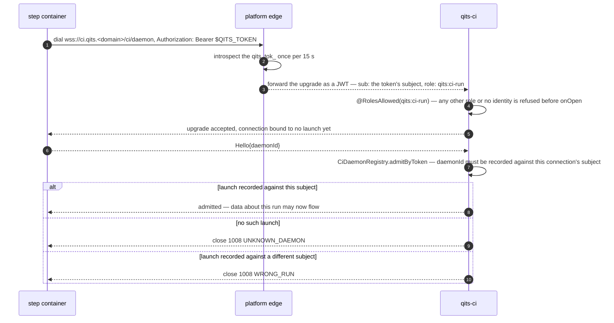

# Step addressing: before and after

This is the record of the CI-runners campaign (qits-438): what a step container was told before, and
what it is told now. The INTERNAL step plane — a step on `qits-net`, dialled by each service's wire
alias — was deleted by qits-ci `2026.930.181549` (epic qits-444, 2026-09-30). The EDGE plane — a step
told the public origin of every service, reached through the platform edge — arrived with epic
qits-441.

## Before and after

| Step env | INTERNAL (today, unchanged) | EDGE |
|---|---|---|
| `QITS_CI_DAEMON_URL` | `ws://<env>-qits-ci:8080/ci/daemon` | `wss://ci.<env>.<domain>/ci/daemon` |
| `QITS_CI_DAEMON_BINARY_URL` | `http://<env>-qits-artifacts:8080/artifacts/daemons/qits-ci-daemon/<v>` | `https://registry.<env>.<domain>/artifacts/daemons/qits-ci-daemon/<v>` (Bearer `QITS_TOKEN`) |
| `QITS_CI_REPOSITORY_URL` | `http://<env>-qits-platform-edge:8080/git/<project>/<repo>` | `https://githost.<env>.<domain>/git/<project>/<repo>` |
| `QITS_DOMAIN` | absent | the bare public domain, `<domain>` — the one address input a recipe reads (qits-731, see below) |
| `QITS_REGISTRY`, `QITS_BUILD_REGISTRY` | internal registry alias | `registry.<env>.<domain>` — **no longer sent since qits-731** |
| `QITS_NPM_REGISTRY_URL`, `QITS_NPM_PROXY_URL` | internal artifacts/mirror aliases + path | `https://registry.<env>.<domain>/artifacts/npm/…`, `https://mirror.<env>.<domain>/…` (same paths, new origins) — **no longer sent since qits-731** |
| `QITS_MAVEN_REGISTRY_URL`, `QITS_MAVEN_*_URL` | internal + path | same paths on the registry and mirror vhosts — **no longer sent since qits-731** |
| `QITS_ARTIFACTS_URL`, `QITS_DOCS_URL` | internal | vhosts — **no longer sent since qits-731** |
| `QITS_WORKSPACES_URL` | internal | vhost |
| `BUILDKIT_HOST` | absent → qits-containers fills `tcp://qits-buildkitd:1234` on `qits-net` | absent → the runner fills its own buildkitd on its bridge |
| network | `qits-net` | none named (runner's default bridge) |
| extra hosts | `host.docker.internal:host-gateway` | none |
| credential | `QITS_COMMISSIONED_CLIENT_ID`/`_SECRET`, `QITS_GIT_AUTH_*` (client-credentials dance at the internal idp) | `QITS_TOKEN`, `QITS_TOKEN_SUBJECT` — and nothing else |
| daemon handshake | asserts `X-Qits-User`/`X-Qits-Roles: qits:system` | `Authorization: Bearer $QITS_TOKEN`; edge introspects; qits-ci sees `qits:ci-run` |

```
git   : credential helper → username=oauth2 password=$QITS_TOKEN        (edge: Basic oauth2:<token> → introspect)
maven : <server><configuration><httpHeaders> Authorization: Bearer $QITS_TOKEN
npm   : //registry.qits.$QITS_DOMAIN/:_authToken=$QITS_TOKEN  (and mirror.qits.$QITS_DOMAIN) — hosts derived from QITS_DOMAIN
docker: config.json auths["registry.<env>.<domain>"].auth = base64("token:$QITS_TOKEN")   (edge realm: Basic any:<token>)
publish: QITS_PUBLISH_TOKEN_COMMAND prints $QITS_TOKEN; qits-publish sends it as Bearer
```

Every one of those lands on the edge, which introspects once per 15 s and forwards a JWT. No hop from
the step touches the idp.

## Where the live estate differs from the dossier's plan

(a) The live estate's public names carry no environment label — `ci.qits.wohlben.eu`,
`registry.qits.wohlben.eu`, `mirror.…`, `githost.…`, `idp.…`, not `ci.dev.…` — because the platform
project itself carries no environment label in the edge's `<app>[.<env>].<project>.<domain>` grammar;
the `<env>` in the table above is only the grammar's slot, and `StepAddressPlane`/`RunnerAddresses`
never fill it for this project.

(b) The per-container daemon secret (`X-Qits-Ci-Daemon-Id`/`-Secret` headers, `QITS_CI_DAEMON_SECRET`)
was deleted too (qits-514, qits-ci-daemon `2026.930.164542`). A daemon names its launch in-band in its
first `Hello` frame, and qits-ci binds that to the run token's subject (`WRONG_RUN` otherwise). So the
handshake has one credential, not two.

(c) The header-asserting daemon (`X-Qits-User`/`X-Qits-Roles: qits:system`) is gone from the daemon.
`/ci/daemon` admits `qits:ci-run` alone from the release that carries qits-516.

(d) The hairpin measurement from the platform host, 2026-09-30 16:38Z: `ci.qits.wohlben.eu` →
`46.224.171.33`, 401 over HTTP/2. So steps on the platform host need no extra hosts.

(e) The live estate's only runner is the external node `qits-ci`. No runner runs on the platform host.
The owner ruled on 2026-09-30 that a cold bootstrap brings the edge up before it starts its same-node
runner, and that runner is EDGE as well.

## Hosts are code: `QITS_DOMAIN` (qits-731)

The registry and mirror URL variables in the EDGE column are no longer sent (qits-ci's second
qits-731 release; the first sent them beside the domain while recipes moved off them). A step is told
`QITS_DOMAIN`, the platform's bare public domain (live: `wohlben.eu`), and the hosts and paths are
constants a recipe spells from it:

| what | address |
|---|---|
| image registry | `registry.qits.$QITS_DOMAIN` |
| hosted npm (`@qits/*`) | `https://registry.qits.$QITS_DOMAIN/artifacts/npm/npm/` |
| npmjs cache | `https://mirror.qits.$QITS_DOMAIN/npm/npmjs/` |
| hosted maven | `https://registry.qits.$QITS_DOMAIN/artifacts/maven/maven` |
| Maven Central cache | `https://mirror.qits.$QITS_DOMAIN/mirror/maven/central` |
| docs store | `https://registry.qits.$QITS_DOMAIN/artifacts/docs/docs` |
| qits CLI the prelude fetches | `https://registry.qits.$QITS_DOMAIN/artifacts/daemons/<package>/<version>` |

Every packaged archetype and platform pipeline reads `QITS_DOMAIN` with a fail-fast
`${QITS_DOMAIN:?…}`, and the composed prelude demands it at the top of every step. It passes it to
image builds as the `QITS_DOMAIN` build-arg; the old URL build-args still ride beside it for the
Dockerfiles that have not moved, and go once none declares them. `QITS_DOMAIN` is never empty in a
step: a qits-ci with no dotted public domain composes no address and launches no step at all
(`EDGE_PLANE_UNCONFIGURED`).

**Lockfiles are installed as committed.** No recipe rewrites a `package-lock.json`'s `resolved`
origins any more; every lockfile is committed resolving against `https://registry.qits.$QITS_DOMAIN/`
or `https://mirror.qits.$QITS_DOMAIN/`, and the composed prelude fails a step whose checkout holds one
naming anything else (`/tmp/qits-lockfile-origins.sh`, the file and up to five entries named).

## What the bootstrap writes from one token

```
git   : credential helper → username=oauth2 password=$QITS_TOKEN        (edge: Basic oauth2:<token> → introspect)
maven : <server><configuration><httpHeaders> Authorization: Bearer $QITS_TOKEN
npm   : //registry.qits.$QITS_DOMAIN/:_authToken=$QITS_TOKEN  (and mirror.qits.$QITS_DOMAIN) — hosts derived from QITS_DOMAIN
docker: config.json auths["registry.<env>.<domain>"].auth = base64("token:$QITS_TOKEN")   (edge realm: Basic any:<token>)
publish: QITS_PUBLISH_TOKEN_COMMAND prints $QITS_TOKEN; qits-publish sends it as Bearer
```

## The handshake, updated for (b) and (c)

No id/secret headers; the daemon's first frame names the launch.


