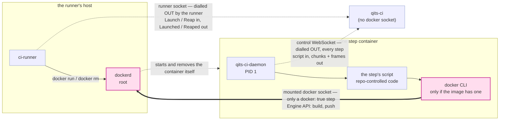
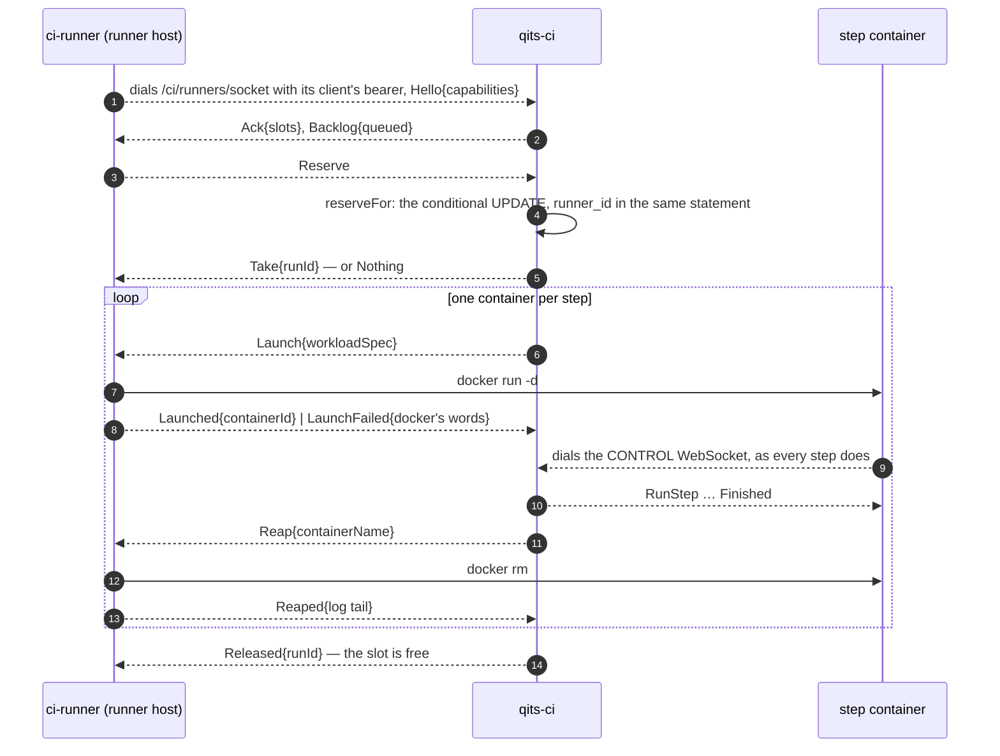

# How a step actually runs — the picture

`README.md`'s **"How a step runs — a runner starts the container, qits-ci only talks to it"** is the
contract; this file does not restate it. It exists for one reason: the arrangement has **two sockets
that share a word**, and every reader who meets them in prose has to be told twice which is which. A
picture is cheaper than re-explaining per reader. (A third socket, the runner's, carries no step data
at all — only `Launch`/`Reap` and the claim — and is drawn below.)

| | the control WebSocket | the host's docker daemon socket |
|---|---|---|
| what | `ws://qits-ci:8080/ci/daemon` (`qits.ci.container-daemon-url`) | a unix socket on the **runner's** host — that host's fact, not qits-ci's |
| who opens it | the **step container**, dialling **out**; qits-ci never dials in | nobody opens it — the runner bind-mounts its own host's socket into the container as a file |
| which steps have it | **every** step, always, since the daemon landed | only a step that declared `docker: true` |
| what rides it | the step's script one way, output chunks and lifecycle frames the other | the docker Engine API, spoken by whatever CLI the step image carries |
| what it grants | "deliver data about this run", authenticated by a per-container secret | **root on the host** — the socket *is* the daemon |
| if it is missing | the step is recorded `NEVER_STARTED` / `CONNECTION_LOST` | a step that asked for it cannot build or push; every other step never notices |

They are unrelated. The control socket is how a step *is* a step; the docker socket is one optional
privilege a repository can ask for in writing.



The dotted line from the daemon is the control socket: outbound, per step, always there. The thick
line is the docker socket: a mount, only on a declared step, and root-equivalent. Note that `dockerd`
is *also* what starts the container in the first place — but it is the **runner's** `dockerd`, driven
by the runner's own `docker run`/`docker rm` on a `Launch`/`Reap` qits-ci sends it. qits-ci holds no
docker socket and calls no orchestrator; the platform host's steps are the `localhost` runner's, which
qits-deployments runs beside qits-ci. What `docker: true` changes is that the step gets to talk to
that `dockerd` too.

## The whole flow, once

```mermaid
sequenceDiagram
    autonumber
    actor Dev as developer
    participant Proj as qits-projects
    participant Git as qits-githost
    participant Bus as qits-events
    participant Art as qits-artifacts
    participant Ci as qits-ci
    participant Runner as ci-runner
    participant Dockerd as runner-host dockerd
    participant Step as step container

    Dev->>Proj: POST /release-requests — the platform runs no CI outside one
    Proj->>Bus: ReleaseRequestChanged{repository, backingBranch, mergedSha}<br/>through the outbox — durable, so a qits-ci that was down reads it back
    Bus-->>Ci: the frame, or a catch-up sweep of it later
    Note over Ci: an ordinary push announces SCMPublishCommit and matches nothing:<br/>per-push CI retired 2026-09-05, so a push triggers no run at all
    Ci->>Git: GET /git/{projectId}/{repoName}/tree/main/.config/qits<br/>then each ci-event-*.yml at the head it answered — no clone, no mirror
    Ci->>Ci: match the event, parse the steps, write the run row QUEUED
    Ci-->>Runner: Backlog{queued}, over the runner socket
    Runner-->>Ci: Reserve
    Ci->>Ci: reserveFor — one conditional UPDATE: RUNNING, runner_id = this runner<br/>then pin the daemon version
    Ci-->>Runner: Take{runId}

    loop one fresh container per step, in sequence
        Ci-->>Runner: Launch{workloadSpec} — entrypoint = the host-authored BOOTSTRAP,<br/>the contract as env, --cap-drop=ALL, no-new-privileges
        Runner->>Dockerd: docker run -d …
        Note over Runner,Dockerd: a step that declared docker: true also gets<br/>the runner host's docker socket mounted here.<br/>Nothing else about the spec differs.
        Dockerd->>Step: started, detached
        Runner-->>Ci: Launched{containerId} | LaunchFailed{docker's words}
        Step->>Art: GET $QITS_CI_DAEMON_BINARY_URL → chmod +x → exec
        Step-->>Ci: ⇠ dials the CONTROL WebSocket, Hello{daemonId, secret}
        Note over Step,Ci: the container dials OUT. qits-ci never dials in and<br/>never learns an address from a container.
        Step->>Git: shallow clone --depth 50, checkout $QITS_CI_SHA
        Step-->>Ci: Initialized — or InitFailed{SHA_GONE}, and ci then asks the host whether<br/>the repository still HOLDS the sha and discards the run only if it does not
        Ci-->>Step: RunStep{script, timeoutSeconds} — the reply IS the step<br/>← host-stamped started_at
        Step-->>Ci: Output{chunk} … many, streamed as the script prints
        Ci->>Ci: each chunk feeds the bounded relay that GET /ci/api/runs/{runId}<br/>exposes as `live` — poll it; there is no SSE and no push
        Step-->>Ci: Finished{exitCode, timedOut} ← host-stamped finished_at
        Ci->>Ci: write the step row ONCE, already terminal
        Ci-->>Runner: Reap{containerName} — on every path, including the bad ones
        Runner->>Dockerd: docker rm -f
        Runner-->>Ci: Reaped{log tail}
    end
    Ci-->>Runner: Released{runId} — the slot is free

    Note over Ci: a red step skips the rest; the remaining rows are written SKIPPED
    Ci->>Bus: BuildSuccessful — only on SUCCESS; BuildFailed with the terminal word otherwise
```

Three things the diagram is deliberately precise about:

- **The script arrives as a reply.** qits-ci initiates nothing toward a container, and never touches
  docker: the container exists because the runner ran `docker run` on a `Launch`. The script is a
  field of the frame answering the daemon's own `Initialized`, which is also why it never appears in
  an argv and why the container never receives the config *file* — only its own step.
- **The row is written once, terminal.** While a step runs it has no row at all; `live` is what makes
  that legible instead of looking like a run with missing steps.
- **The last arrow goes to the bus and to nobody in particular.** It used to be a POST to
  qits-platform-deployments' `/events/build-succeeded`, drawn here because a green run *was* a
  deployment. Both halves of that have gone: qits-ci published its last such POST some releases ago,
  and the deployer has since removed the path itself — a green build is no longer a reason to put
  anything live. `BuildSuccessful` is a verdict about a commit now, and its consumer is
  qits-projects' release-request quality gate.

## The runner socket, on its own

Every run is a runner's — there is no in-process executor (deleted in qits-506). The runner socket
carries the claim and the container's lifecycle; the control WebSocket still carries the step.



A runner socket that closes mid-step keeps the step's container on the runner; the run waits the
reconnect grace for the runner's next `Hello` to claim it, and ends the step `CONNECTION_LOST`, naming
the runner, if nobody does. What a previous life of a runner left behind is removed by that runner's
own boot sweep — qits-ci reaps nothing.

## Where a publishing step fits

```mermaid
sequenceDiagram
    autonumber
    participant Ci as qits-ci
    participant Step as final step container
    participant Dockerd as runner-host dockerd
    participant Reg as qits-artifacts registry
    participant Bus as qits-events
    participant Pd as qits-platform-deployments

    Ci-->>Step: RunStep{script} over the control WebSocket
    Note over Step: the script is just a script:<br/>ref="$QITS_REGISTRY/$QITS_IMAGE_REPOSITORY/APP:$QITS_CI_SHA"<br/>docker build -t "$ref" . && docker push "$ref"
    Step->>Dockerd: build, over the MOUNTED docker socket<br/>(the CLI streams the context; the daemon builds)
    Dockerd->>Reg: PUT blobs + manifest — tokenless for producers
    Step-->>Ci: Output{chunks} — the build log, over the control WebSocket
    Step-->>Ci: Finished{exitCode}
    Ci->>Bus: SoftwareRelease{repoId, projectId, version, package} — one per published declaration
    Bus-->>Pd: the frame, durably; a deployer that was down reads it back
    Pd->>Reg: pull REGISTRY/REPOSITORY/APP:VERSION — the tag convention, unenforced
```

Nothing here is a new mechanism. The push is a step's exit code like any other — a failed push is a
failed step is a failed run, so the announcement (published declarations only) keeps implying the
image exists. **What the deployer hears is the release and not the build**: it subscribes to
`SoftwareRelease`, so a repository whose pipeline publishes nothing deploys nothing, however green
it goes. Its HTTP intake still takes a `POST /platform-deployments/api/events/software-released`,
and that door is a bootstrap's and an operator's — qits-ci calls it never.

`$QITS_REGISTRY` and `$QITS_IMAGE_REPOSITORY` are injected into *every* step container so the script
names no deployment fact; `$QITS_CI_SHA` was already there.

And note who dials the registry in that diagram: **`Dockerd`, not `Step` and not `Ci`.** The CLI on
the far side of the mounted socket is a client; the host's daemon is what resolves the registry name,
negotiates TLS and performs both the build and the push. That is why the deployment prerequisite is
about the *runner host's* view of the registry — resolvable from there, and in
`insecure-registries` while it speaks plain HTTP.

**A converted recipe replaces `Dockerd` in that diagram with the platform builder.** The step calls
`buildctl` against `$BUILDKIT_HOST` — the builder the runner owns, which fills that variable in — and
the *builder* pulls the bases (rewriting the committed vhost spellings to
the in-network aliases via its own registry config) and pushes the ref the step composed from
`$QITS_BUILD_REGISTRY`, all without the host daemon in the path. The socket stays mounted until the
last recipe converts; see the README's `docker: true` section and the wrapper's
`qits-buildkit-plan.md`.
